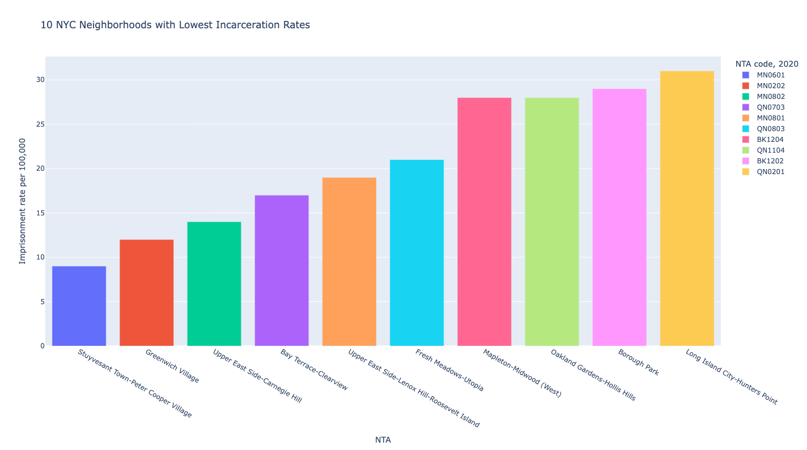

# Final Project - Natalie Temple

For my final project, I wanted to use python to create some data visualizations (similar to those I created for assignment 6) that I could use for my thesis.

## Thesis Description

My thesis argues that due to a lack of empirical data collection on women under carceral control as well as a tendency to overlook them in “bigger picture” conversations around mass incarceration, the growing focus on decarceration, reform, and justice reinvestment has tended to disproportionately benefit men, as the interventions have been tailored to this larger segment of the carceral population.

Therefore, my thesis proposes the creation of educational/training materials for law or other graduate level criminal justice students utilizing storytelling from both data and first-hand narrative sources which center the experiences of women under carceral control, which are historically understudied and still often overlooked in discussions around the issue, intervening at a critical point in future practitioners’ education to hopefully achieve the following goals: (1) bring attention and visibility to these often obscured narratives; (2) shift the way conversations surrounding mass incarceration are had to not only focus on women as a distinct population but to center and emphasize the needs of this population so that decarceration efforts can be more effective.

## Code and Results

[My code one](us.py)

[My code two](mass.py)

[My code three](vishw.py)

## Thesis Integration

I integrated these into my thesis in a few different places.

