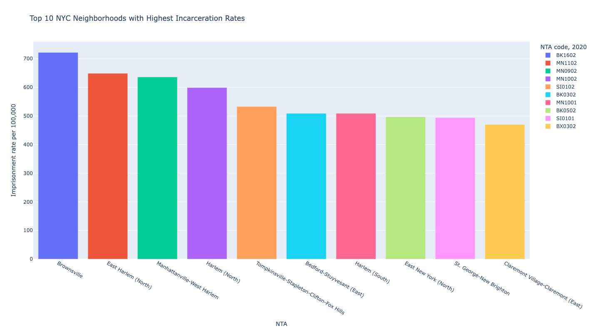
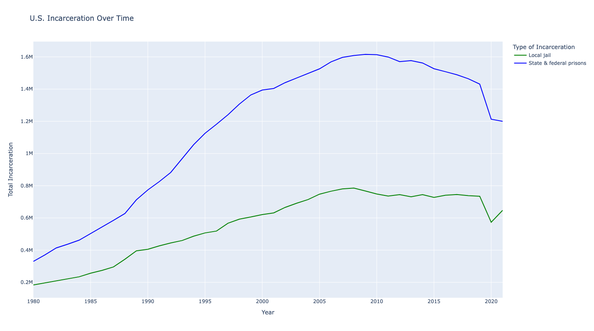

# Final Project Proposal - Natalie Temple

For my final project, I want to use python to create some data visualizations (similar to those I created for assignment 6) that I can use for my thesis. I made one test visualization to experiment with this idea which I have included below.

## Assignment 6 Data Visualizations

## Test Data Visualization

