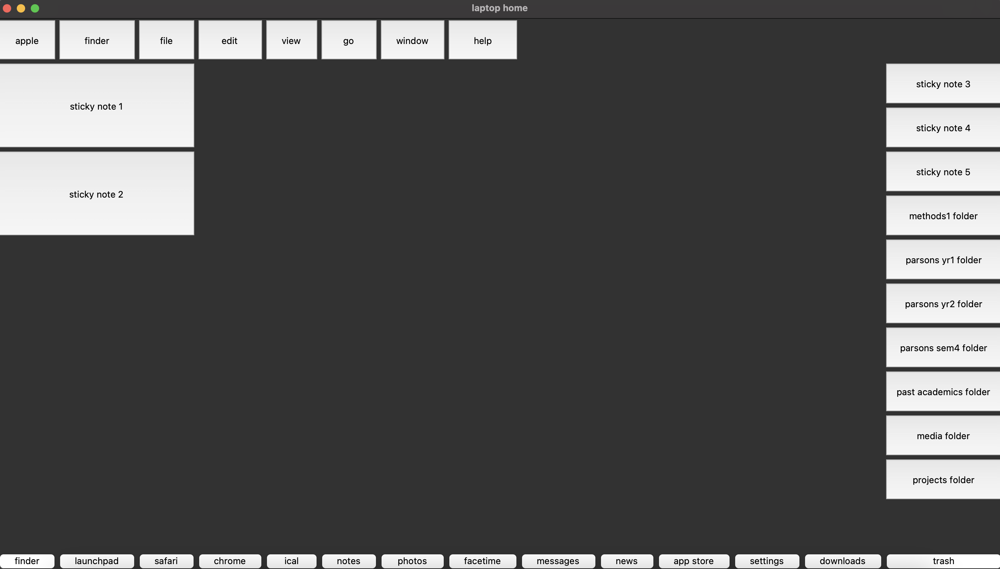

# GUI
## Assignment 9 - Natalie Temple

For this week's assignment I chose to roughly recreate the user interface layout of my laptop homescreen. This was mainly a process of translating the icons, folders, apps, and menus on my laptop screen into buttons on the grid. I've included both a screenshot of my homescreen as well as the grid-in-progress for comparison.

[My Code](hwgui.py)

