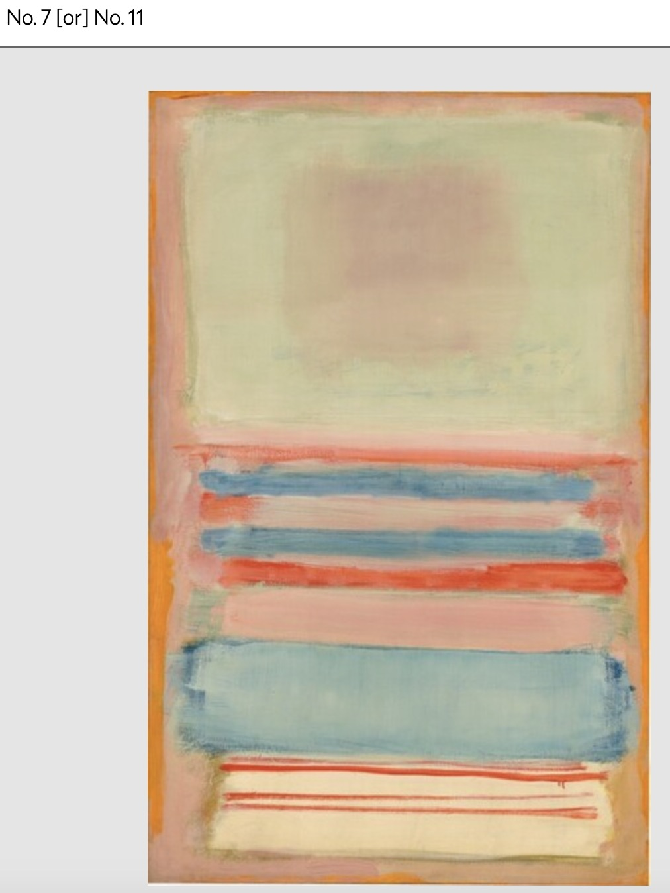
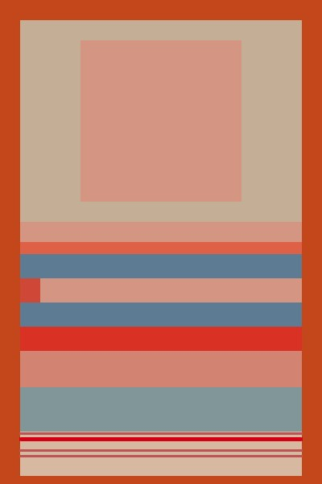

# Mark Rothko Recreation
## Assignment 2 - Natalie Temple
For this week's assignment, I chose to recreate Mark Rothko's "No. 7 or No. 11, 1949"

I chose this piece because I thought it would give me the opportunity to practice and get comfortable with the syntax of py5 without getting overwhelmed by trying something too complex. I was also interested to see how it would look when it lost the character and texture visible in the painted version due to the limitations of the py5 drawing style.

[Code](art_homework.py)