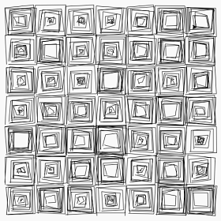
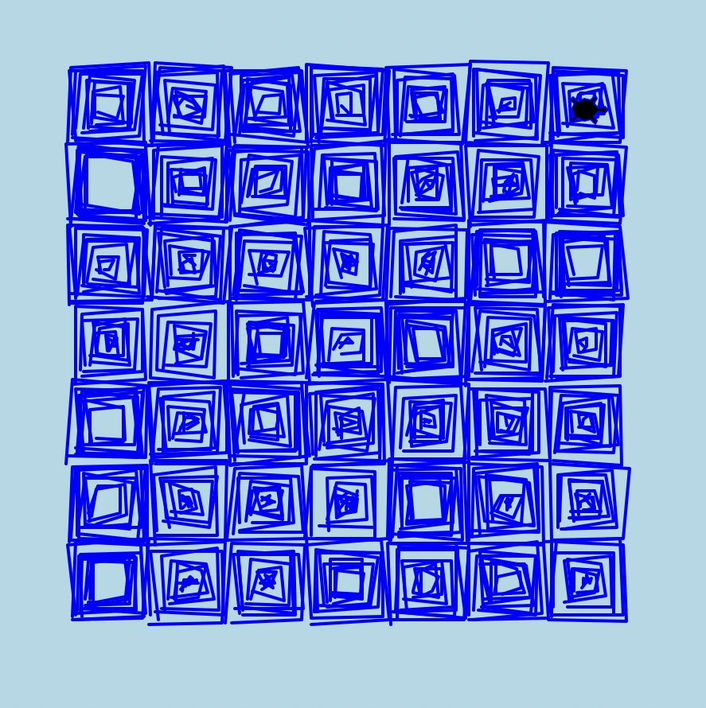

# Turtle Graphics - Vera Molnár Recreation
## Assignment 4 - Natalie Temple
For this week's assignment, I chose to recreate one of Vera Molnár's works.

I altered the colors of the artwork for fun.

[Source Code](https://www.101computing.net/vera-molnar-artwork-revisited-using-python/)

[My Code](turtlehw.py)

