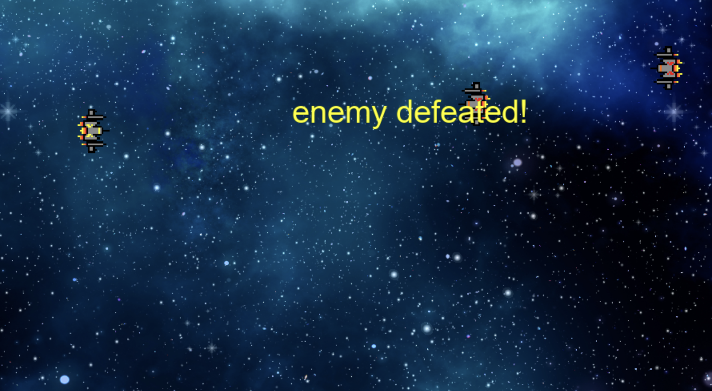

# Pygame Update
## Assignment 5 - Natalie Temple
For this week's assignment, I chose to update our pygame that we coded in class.

I added sound effects for when a bullet is shot and when a bullet collides with an enemy, and I added text each time an enemy is struck with a bullet that says "enemy deafeated!"

[My Code](main.py)