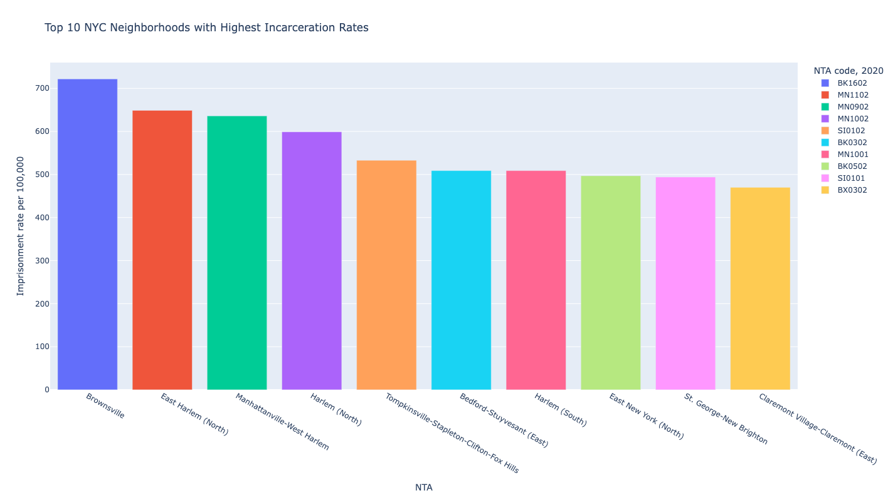
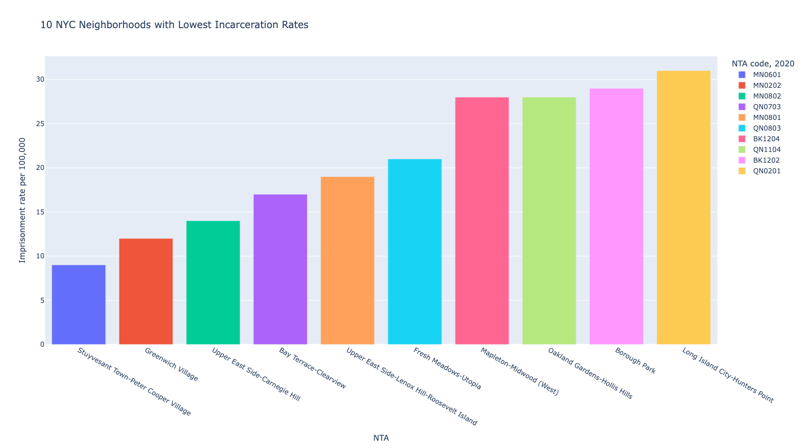

# Data Vis
## Assignment 6 - Natalie Temple
For this week's assignment, I used a data set on incarceration rates per neighborhood (Neighborhood Tabulation Area) in New York City. This data set was sourced from the Prison Policy Initiative.

[Source Data](https://www.prisonpolicy.org/origin/ny/2020/nyc_nta.html)

My primary questions guiding my visualizations of this data were:
- What are the 10 neighborhoods with the highest incarceration rates?
- What are the 10 neighborhoods with the lowest incarceration rates?
- Is there a trend between incarceration rates and total population?

I produced the following bar charts, plus a scatter plot that didn't really show anything so I didn't include it here.

[My Code](vishw.py)

[My Data](2020nyc_incarceration_rates.csv)