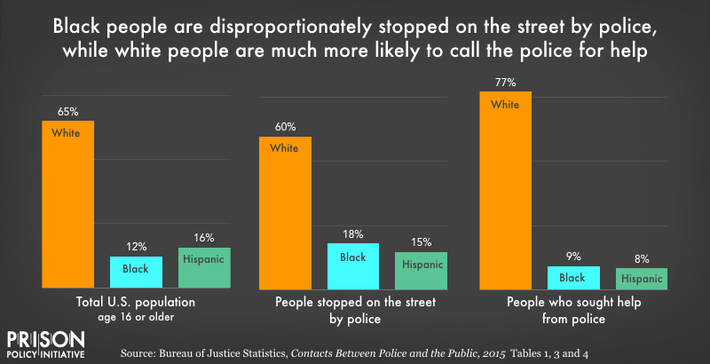
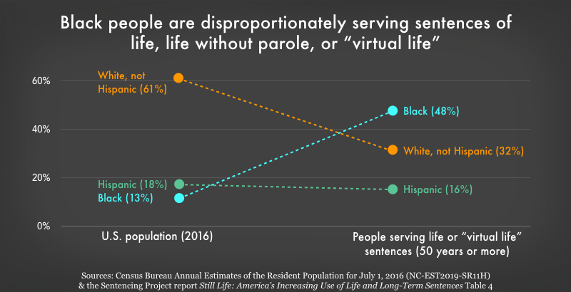
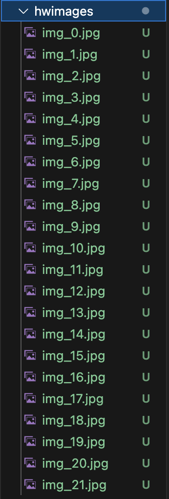

# PPI Image Webscraping
## Assignment 7 - Natalie Temple

For this week's assignment, I wanted to scrape images of data visualizations relevant to my thesis topic as I am currently in the process of recreating some for my own project.

This assignment actually took me four attempts because the first two websites I tried appeared to have blockers that prohibited the requests for the image URLs. I looked at lots of resources to try to troubleshoot this code when I had issues.

On my first attempt, I ran into the same issue that we had in class when I got the "urllib.error.URLError: urlopen error no host given" error. I tried the method that worked for me in class but it didn't work this time, so I looked on some substacks until I found a solution that worked for me. The solution involved creating a variable for the website's "base url" and using a 'urljoin' method with the src link and the base link to create the full image link. Unfortunately, the results just weren't as fruitful as I wanted even when I did get the code working successfully, so I went to try the method on a different website.

On the second attempt, the method appeared to be working but then I got an error I hadn't seen before, which was "HTTPError: 403". I learned that this meant the website likely had servers blocking the requests for the image urls because they were coming from a script rather than a server, so then I decided to use an ai source to ask if there was a way to bypass this. I tried two different suggestions but neither of them worked, so I decided to move on to a different website.

When I tried the third website, I got the same "HTTPError: 403", so again, I decided to move on to a different website.

Finally, on the fourth attempt, I was able to successfully download the images from a Prison Policy Institute website.

The full folder of images is [here](hwimages)

## Example Images

[Code](scrapehw.py)